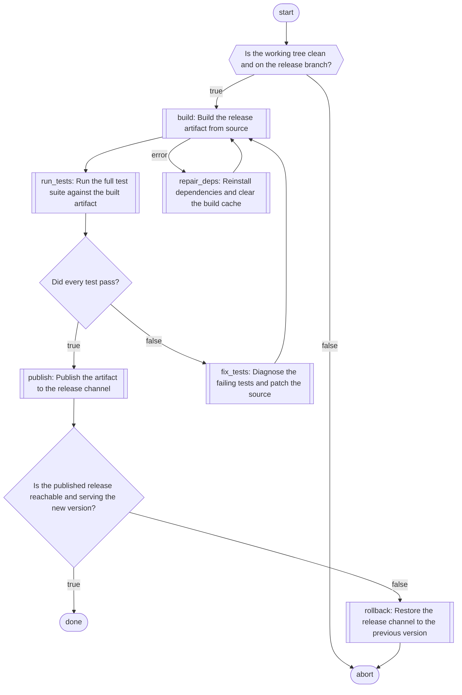

# LLAssemblyCLI.

### Code driven agents orchestration

 ⚠️  The `stable-monty` branch used only for pre-assembled releases of the skill with a pydantic-monty planner variant.
Actual work happens on the `main` branch.

LLAssemblyCLI is a portable skill for agents orchestration that you can run in agentic CLI
you already use:
1. **Compiles** your request into an explicit control-flow program to orchestrate sub-agents.
2. **Runs** that deterministic program dispatching sub-agents, feeding their results back into
the control-flow state that decides what should be the next step.
3. **Persists** every step to an append-only log so the loop can be paused, inspected, and
   resumed after a crash without losing its place.

If you've used Claude Code's Dynamic Workflows, the core concept is similar here, except:
- LLAssemblyCLI runs workflows as a skill in any: ClaudeCode, OpenCode, Codex, pi, ...
- Plan is represented in many different ways, including: Python, Mermaid, DSL Assembly.
- Runs locally: workflow can be evaluated and reproduced.
- Reliably executed under other skill definitions (can be nested in other skills).
- If needed LLAssemblyCLI can run itself (and any plan) on top of Claude Workflows.

LLAssemblyCLI ships with 4 variants of the control-flow:
- Python with pydantic-monty
- Pure Python
- Mermaid diagrams
- Assembly-like DSL (based on LLAssembly project)

https://github.com/user-attachments/assets/6b28c830-390a-452e-88ec-08a71cac5a52

> ⚠️ **Work in progress:** this library is under active development.
> Reports in Issues are appreciated.

## What it is

The common way to orchestrate agents is to put an **orchestrator agent** in
charge. The control flow lives inside the model's head and depends on the multiple
factors during runtime.

**You cannot review a decision tree up-front, and you cannot reproduce decision
that was made from context you no longer have.**

LLAssembly inverts this. Use the model once, up front, to compile your goal
into a control-flow program — then let plain deterministic code execute it:
- It spawns sub-agents per workflow step
- Feeds each result back to the code-plan
- Decides on the next step based on the control-flow definitions in the code

When loop is started the **pre-generated code** — never the model — decides the
next branch, retry, or loop.

This buys two things the orchestrator-agent pattern cannot guarantee:

- **Reliability of the execution plan.** Branches and loops are real code with
  real conditions, not a model's moment-to-moment judgement. The plan is
  written once, reviewed, and then followed faithfully.
- **Reproducible execution.** The same plan plus the same sub-agent results
  produce the same path every time. Execution state is persisted, so a loop can
  be paused, inspected, replayed, or resumed after a crash without losing its
  place.

Here is what a workflow looks like in mermaid plan variant. It is parsed,
emulated and the drives your CLI tool to spawn sub-agents as defined:

```
flowchart TD
    start([start]) --> implement[[implement: add retry logic to client.py]]
    implement --> tests[[run_tests: run the suite and report failures]]
    tests --> passed{"Did every test pass?"}
    passed -- true --> done([done])
    passed -- false --> fix[[diagnose_and_fix: find the cause and patch it]]
    fix --> tests
```

You can also include such plan in any other skill and say "drive that with
llassembly-agentic-workflow" ensuring reliability of how sub-agents spawns.

## Installation

No dependencies needed. Git clone -> run a Python script to copy one of the skill 
variants into the target dir.

```bash
python copy_skill_to.py llassembly <target_dir>   # build the ASM-emulator variant skill
# or
python copy_skill_to.py python    <target_dir>     # build the Python-planner variant skill
# or
python copy_skill_to.py monty     <target_dir>     # build the Pydantic-Monty variant skill
# or
python copy_skill_to.py mermaid   <target_dir>     # build the mermaid variant skill
```

npx skills:
```bash
# ASM-emulator variant skill
npx skills add https://github.com/electronick1/LLAssemblyCLI/tree/stable-llassembly/llassembly-agentic-workflow

# Python-planner variant skill
npx skills add https://github.com/electronick1/LLAssemblyCLI/tree/stable-python/llassembly-agentic-workflow

# Pydantic-Monty variant skill
npx skills add https://github.com/electronick1/LLAssemblyCLI/tree/stable-monty/llassembly-agentic-workflow

# Mermaid variant skill
npx skills add https://github.com/electronick1/LLAssemblyCLI/tree/stable-mermaid/llassembly-agentic-workflow
```

The variant you build determines which **emulator/planner** executes the plan (see more details in further
sections). There are four, and they make different trade-offs.

| Variant | Plan language | Sandboxed | Best for |
|---------|---------------|--------|----------|
| `mermaid` | Mermaid diagram | **Yes**, a mermaid graph iteration | Easy use by humans, portability |
| `llassembly` | Assembly-like instruction set | **Yes**, a simple emulator (no file/syscall/network instructions) | Small models, CLI tasks |
| `monty` | Plain Python `def main()` | **Medium** — pydantic-monty (Rust-emulation, WIP) | Complex branching with an added safety layer |
| `python` | Plain Python `def main()` | **No** — raw `exec()`, your own sandbox required | Complex branching, structured JSON outputs |


### Configuration

#### LLAssembly skill runtime:

The plan file (`plan_llassembly.<ext>`) and the append-only `runtime.log` are written to
a per-workflow directory `<base>/llassembly/<workflow-id>/`, where `<base>` defaults to
`/tmp`.

To save it elsewhere, set the `LLASSEMBLY_WORKFLOW_PATH` environment variable before the
first execution — e.g. `export LLASSEMBLY_WORKFLOW_PATH=~/.cache` writes to
`~/.cache/llassembly/<workflow-id>/`.

#### Claude workflow integration:

The skill can also be driven by Claude Code's Dynamic Workflows. Copy
`assets/llassembly-claude-workflow.js` into `<project>/.claude/workflows/`, then:

```bash
/llassembly-claude-workflow <goal>
```

LLAssemblyCLI will be executed on top of Claude dynamic workflows - each Claude agent
seeks for the next instruction from LLAssemblyCLI planner and executes it, the workflow
runs until all steps in the plan are done.

#### Pre-generate control-flow plan (workflow) and save it.

You can ask `llassembly-agentic-workflow` to pre-generate and save control-flow (workflow) without
execution. Just say that in the request to the model (e.g. ".... Save workflow without execution.").
CLI/model will ask you about skill name, and it will be saved in the project path to the skills
(depending on the CLI tool you use).

### Mermaid-based planner variant

Executes a mermaid flowchart directly as a control-flow graph that spawns and orchestrates
agents.


| Shape | Meaning |
|---|---|
| `start([start])` | Entry point. Exactly one per plan. |
| `done([done])` / `abort([abort])` | Success / failure exits. At least one required. |
| `id[[name: objective]]` | Invoke the sub-agent `name`. |
| `id{"Question?"}` | Decision answered by the **preceding** sub-agent — free. |
| `id{{"Question?"}}` | Decision answered by its **own** sub-agent — costs one call. |

- **A plain decision costs no sub-agent call.** A `{ }` node is attached to the single
  sub-agent above it as an extra output key on that agent's contract.
- **User Friendly** The nice way to work with mermaid, as an orchestrator, is to ask
  model to generate plan/sub-agents and verify/extend/edit it by yourself.
  It is user friendly way to navigate through workflow before execution.
- **Nested skills** Mermaid plans are great when you want to use LLAssemblyCLI from other
  skills - include mermaid diagram to your skill, tell it to use llassembly-agentic-workflow
  and you get workflow running by LLAssemblyCLI or Claude Dynamic Workflows.

More info: `mermaid_skill_parts/references/workers/llassembly-control-flow.md`.

### Assembly-based planner variant

Executes Assembly-like plan emitted by LLM in a lightweight emulator with a deliberately
**limited instruction set** (`MOV`, `PUSH`/`POP`, `ADD`/`SUB`, `CMP`,
conditional jumps, `CALL`/`RET`, and a handful of macro/`db` directives). Because
the plan can only express this tiny, well-defined set of operations:

- **No extra hardening layers required.** The emulator (see emulator.py) can only do what its
  instruction table allows — there are no file, syscall, or internet-related
  instructions; mainly: CMP, jumps, numbers/strings manipulation, that are emulated
  in a limited and controlled way, only to connect sub-agents together,
  see: `asm_skill_parts/references/workers/llassembly-control-flow.md` for more details.
- **Plans stay stable even on small models.** The narrow grammar is easy
  for weak models to emit correctly and to keep consistent across a long loop.
- Emulator is based on [LLAssembly](https://github.com/electronick1/LLAssembly) project.

This plan type shines when you want to run CLI based skills without extra infrastructure,
and it performs quite well even on very small models like qwen3.6:35b.

### Monty-based planner variant

Uses the same Python plan language as the Python variant, but replaces raw
`exec()` with [`pydantic_monty`](https://github.com/pydantic/monty) as
the execution engine.

- `pydantic-monty` does not guarantee 100% safety, since full Python emulation in
  Rust may contain security issues in its implementation and **pydantic-monty project is itself
  a work-in-progress**.
- `pydantic-monty` is a non-stdlib dependency. Before running this variant, ensure `pydantic_monty`
  is available in your Python environment. You can also specify the runtime in your prompt — for example:
  "Use `uv run` to execute Python".

This plan type is well suited when the orchestration logic is complex and
benefits from a full programming language, with an additional layer of
security compared to the YOLO Python variant.

### YOLO Python-based planner variant

Executes **raw Python emitted by the LLM**: the plan is a small script that
declares sub-agents and drives them from a `def main()` entry point,
branching with ordinary `if`/`while` and returning rich values.

- ⚠️ **WARNING!** The Python-based planner runs LLM generated Python code,
  **it must run in a safe sandboxed environment.** Treat the python-based planner code as untrusted code! 
  Running LLM generated code is never safe — and you are solely responsible for securing the
  environment in which it executes.
- **Good for control flows with many branches and JSON outputs.** Full Python
  expressiveness makes complex branching and structured (JSON) sub-agent
  results natural to handle.

This plan type is well suited when the orchestration logic is complex and
benefits from a real programming language, but extra secure infrastructure is
required.


## Demo

The following shows what happens when you use the skill in Opencode as an example.
The goal in this example is: *"implement the retry logic in `client.py`, run the test suite,
diagnose failures, fix them, and verify all tests pass — up to 5 attempts."*

**1. Install the skill into your OpenCode config dir**

```bash
git clone https://github.com/electronick1/LLAssemblyCLI
cd LLAssemblyCLI
python copy_skill_to.py llassembly .opencode/skills/
# ✓ Successfully created skill at: .opencode/skills/llassembly-agentic-workflow
```

**2. Start an OpenCode session with the skill loaded and state your goal**

```
> Implement retry logic in client.py, run the tests, diagnose and fix failures,
  verify all tests pass — up to 5 attempts.
```

**3. The skill compiles the goal into a control-flow plan**

The orchestrator calls `get_next_instruction.py` and is told to run the
`llassembly-control-flow` sub-agent, which writes `plan_llassembly.<ext>` (in one of 4
variants: assembly-like, mermaid, python, python for pydantic-monty):

```asm
%macro agent_implement
%include "general/implement"
%define OBJECTIVE "Implement retry logic in client.py"
%define OUTPUT_1 "status: \"ok\" or \"error\""
%endmacro

%macro agent_test
%include "general/test"
%define OBJECTIVE "Run the test suite and report results"
%define OUTPUT_1 "passed: \"true\" or \"false\""
%define OUTPUT_2 "failure_summary: brief description of failures if any"
%endmacro

%macro agent_diagnose_and_fix
%include "general/diagnose_and_fix"
%define OBJECTIVE "Diagnose test failures and apply fixes"
%define OUTPUT_1 "status: \"ok\" or \"error\""
%endmacro

    MOV R20, 0                  ; initialize retry counter to zero
loop:                           ; loop head: start of retry cycle
    agent_implement             ; invoke implement sub-agent
    MOV R1, OUTPUT_1            ; copy implement result into R1
    CMP R1, "ok"                ; compare implement status against "ok"
    JNE done_fail               ; if implementation failed, jump to failure exit
    agent_test                  ; invoke test sub-agent
    MOV R2, OUTPUT_1            ; copy test result into R2 (distinct register)
    CMP R2, "true"              ; compare test pass flag against "true"
    JE done_success             ; if all tests passed, jump to success exit
    ADD R20, 1                  ; increment retry counter by one
    CMP R20, 5                  ; compare retry counter against max of 5 attempts
    JGE done_fail               ; if retry budget exhausted, jump to failure exit
    agent_diagnose_and_fix      ; invoke diagnose_and_fix sub-agent
    JMP loop                    ; jump back to loop head to retry
done_success:                   ; success exit label
    MOV R10, 0                  ; set exit code to zero (success)
    JMP done                    ; jump to single completion path
done_fail:                      ; failure exit label
    MOV R10, 1                  ; set exit code to one (failure)
done:                           ; single completion label for all exit paths
    RET                         ; return from main execution
```

**4. The driver generates any missing sub-agent definitions**

Before execution begins, the driver scans the plan for every declared sub-agent and checks
whether a definition file already exists. For each one that is missing it runs the
`llassembly-generate-sub-agents` agent, which writes a ready-to-use `.md` definition
into the workflow's `references/agents/` directory.

```
[driver] → missing agent: implement   → running llassembly-generate-sub-agents...
           ✓ references/agents/implement.md written
[driver] → missing agent: test        → running llassembly-generate-sub-agents...
           ✓ references/agents/test.md written
[driver] → missing agent: diagnose_and_fix → running llassembly-generate-sub-agents...
           ✓ references/agents/diagnose_and_fix.md written
[driver] → all agents present, starting execution
```

**5. The driver executes the plan — one sub-agent at a time**

```
[driver] → run sub-agent: implement   (writes retry logic to client.py)
[driver] → run sub-agent: test        (2 failures found)
[driver] → run sub-agent: diagnose_and_fix  (fixes import error + off-by-one)
[driver] → run sub-agent: test        (all tests pass)
[driver] Execution finished. Goal is achieved.
```

Every step is appended to `/tmp/llassembly/<workflow-id>/runtime.log` as JSONL. If the session
crashes between any two steps, re-running the driver replays the log and resumes from exactly
where it left off — no work is repeated.

## What `plan_llassembly.<ext>` looks like

All four variants express the **same** kind of plan — declare the sub-agents the
control flow invokes, then orchestrate them with a bounded, verify-driven loop —
in their own language. The plan file is always `plan_llassembly.<ext>`; the ASM
variant fills it with assembly, the mermaid variant with a flowchart, and the
Python and Monty variants with a Python script.

### Assembly variant

```asm
%macro agent_build                 ; Declare the build sub-agent (interface only)
%include "general/build"           ; Where the build sub-agent's specification belongs
%define OBJECTIVE "Build the project artifact from source"  ; One-sentence objective
%define OUTPUT_1 "status: \"ok\" on success or \"error\" on failure"  ; Build status contract
%endmacro                          ; End of build sub-agent declaration

%macro agent_verify                ; Declare the verifier sub-agent (interface only)
%include "general/verify"          ; Where the verifier sub-agent's specification belongs
%define OBJECTIVE "Verify the built artifact passes all checks"  ; One-sentence objective
%define OUTPUT_1 "all_passed: \"true\" if every check passed, else \"false\""  ; Verify contract
%endmacro                          ; End of verifier sub-agent declaration

   MOV R20, 0                      ; Initialize retry counter to zero
build_and_verify:                  ; Loop head: build the artifact then verify it
   agent_build                     ; Invoke the build sub-agent
   MOV R1, OUTPUT_1                ; Copy build status into R1 before it is overwritten
   CMP R1, "ok"                    ; Compare build status output against success indicator
   JNE handle_failure              ; If build failed, go to the failure/retry handler
   agent_verify                    ; Invoke the verifier sub-agent
   MOV R2, OUTPUT_1                ; Copy verifier result into R2 (distinct register)
   CMP R2, "true"                  ; Compare verifier pass flag against "true"
   JE done_success                 ; If verification passed, the goal is achieved
handle_failure:                    ; Failure handler: spend one retry if budget allows
   ADD R20, 1                      ; Increment the retry counter
   CMP R20, 3                      ; Compare retry counter against the maximum of 3 attempts
   JGE done_giveup                 ; If budget exhausted, stop retrying and give up
   JMP build_and_verify            ; Otherwise loop back and rebuild then re-verify
done_success:                      ; Success exit: verifier confirmed the goal
   MOV R10, 0                      ; Set exit code to zero indicating success
   JMP done                        ; Jump to the single completion path
done_giveup:                       ; Give-up exit: retry budget exhausted
   MOV R10, 1                      ; Set exit code to one indicating failure
done:                              ; Single completion label for all exit paths
   RET                             ; Return from main execution reaching completion
```


### Python (or python monty) variant

```python
# Declare the build sub-agent (interface only — no behavior implemented).
setup_sub_agent(
    name="build",
    objective="Build the project artifact from source",
    output_spec={"status": 'status: "ok" on success or "error" on failure'},
    existing=False,
)


# Declare the verifier sub-agent (interface only — no behavior implemented).
setup_sub_agent(
    name="verify",
    objective="Verify the built artifact passes all checks",
    output_spec={"all_passed": 'all_passed: "true" if every check passed, else "false"'},
    existing=False,
)


def main():
    attempts = 0          # initialize the retry counter
    max_attempts = 3      # bound the loop so the plan always terminates
    succeeded = False     # track whether the goal was achieved

    while attempts < max_attempts:                # loop until verified or budget exhausted
        attempts += 1                             # spend one retry on this iteration
        build_result = run_sub_agent("build")     # invoke the build sub-agent
        build_status = build_result["status"]     # capture build status before reuse
        if build_status != "ok":                  # build failed
            continue                              # retry the build on the next iteration
        verify_result = run_sub_agent("verify")   # invoke the verifier sub-agent
        verify_passed = verify_result["all_passed"]  # capture verifier flag distinctly
        if verify_passed == "true":               # verification confirmed the goal
            succeeded = True                      # record success
            break                                 # the goal is achieved; stop looping
        # verification failed; loop back to rebuild and verify again

    exit_code = 0 if succeeded else 1     # zero on success, one when the budget ran out
    return exit_code
```


### Mermaid variant

<details>
<summary>Click to expand rendered mermaid:</summary>


</details>

```
flowchart TD
    %% A gate before any work. Nothing precedes it, so it needs its own sub-agent ({{ }})
    start([start]) --> q_clean
    q_clean{{"Is the working tree clean and on the release branch?"}}
    q_clean -- true --> w_build
    q_clean -- false --> abort

    %% An error edge is worth drawing only because a real recovery follows it
    w_build[[build: Build the release artifact from source]] --> w_test
    w_build -- error --> w_deps
    w_deps[[repair_deps: Reinstall dependencies and clear the build cache]] --> w_build

    %% run_tests reports its own status and answers the question below, in one call
    w_test[[run_tests: Run the full test suite against the built artifact]] --> d_pass
    d_pass{"Did every test pass?"}
    d_pass -- true --> w_publish
    d_pass -- false --> w_fix
    w_fix[[fix_tests: Diagnose the failing tests and patch the source]] --> w_build

    %% Verify the outcome rather than trusting the step that produced it
    w_publish[[publish: Publish the artifact to the release channel]] --> d_live
    d_live{"Is the published release reachable and serving the new version?"}
    d_live -- true --> finish
    d_live -- false --> w_rollback
    w_rollback[[rollback: Restore the release channel to the previous version]] --> abort

    finish([done])
    abort([abort])
```

