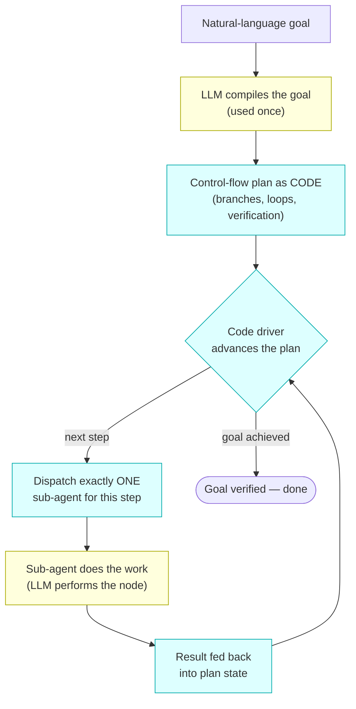

# LLAssemblyCLI. <br> Code driven sub-agents and loop orchestration

LLAssemblyCLI is a skill whose defining idea is simple: 
**don't let an LLM improvise the orchestration — compile it into code and let code drive it.**

## What it is

The common way to orchestrate sub-agents is to put an **orchestrator agent** in
charge: a top-level LLM decides, step by step and in natural language, which
sub-agent to call next, reads the output, then reasons about what to do after
that. The control flow lives inside the model's head. It is flexible, but it is
also **non-deterministic and hard to reproduce** — the same goal can take a
different path on every run, the branching logic is implicit, and long loops
drift as the context window fills with history.

LLAssembly inverts this. Instead of orchestrating sub-agents *with* an
orchestrating agent, the LLM is used **once** to compile the goal into an
explicit **control-flow plan written as code** (`plan.llassembly`). From that
point on, a small, deterministic driver/emulator executes the plan: it advances
to the next sub-agent invocation, asks the harness to run exactly that one
sub-agent, feeds the returned result back into the plan's state, and lets the
**code** — not a model — decide the next branch, retry, or loop. The model only
performs the work at each node; the plan owns the control flow.

This buys two things the orchestrator-agent pattern cannot guarantee:

- **Reliability of the execution plan.** Branches and loops are real code with
  real conditions, not a model's moment-to-moment judgement. The plan is
  written once, reviewed, and then followed faithfully.
- **Reproducible execution.** The same plan plus the same sub-agent results
  produce the same path every time. Execution state is persisted, so a loop can
  be paused, inspected, replayed, or resumed after a crash without losing its
  place.


## The concept

The plan is the program. The LLM compiles the goal into it; a code driver
executes it; sub-agents are dispatched one at a time and their results are fed
back so the *code* decides what happens next.



The yellow nodes are where an LLM is used (compile the plan once, perform the
work at each node). Everything in blue — the plan, the driver, dispatch, and
result feedback — is deterministic code. Control flow never leaves the code.

## Installation

No dependencies needed. Git clone -> run python script to copy skills in the target dir.

Two build scripts exists for different types of planners, both copy the
shared parts of the skill into a target directory as `llassembly-agentic-loop-skill`,
then overlay one of the emulator/planner skill parts on top. 
The target directory must already exist.


```bash
python copy_asm_skill_to.py <target_dir>      # build the ASM-emulator variant skill
# or
python copy_python_skill_to.py <target_dir>   # build the Python-planner variant skill
```


> **Work in progress:** this library is under active development. There may be
> bugs and issues, use it carefully — reports in Issues are appreciated.


The variant you build determines which **emulator/planner** executes the plan. There are
two, and they make different trade-offs

### Assembly-based planner

A lightweight emulator for an assembly-like language with a deliberately
**limited instruction set** (`MOV`, `PUSH`/`POP`, `ADD`/`SUB`, `CMP`,
conditional jumps, `CALL`/`RET`, and a handful of macro/`db` directives). Because
the plan can only express this tiny, well-defined set of operations:

- **No extra hardering layers required.** The emulator can only do what its
  instruction table allows — there is no files, syscalls or internet related
  instructions; mainly: CMP, jumps, numbers/strings manipulation, that are emulated
  in a limited and controlled way, see: `asm_skill_parts/agents/llassembly-control-flow.md`
  for more details.
- **Plans stay stable even on small models.** The narrow grammar is easy
  for weak models to emit correctly and to keep consistent across a long loop.
- Emulator is based on [LLAssembly](https://github.com/electronick1/LLAssembly) project.

This plan type shines when you want to run without extra infrastructure, and it's performs
quite well even on very small models like qwen3.6:30b.

### Python-based planner

Executes **raw Python emitted by the LLM**: the plan is a small script that
declares sub-agents and drives them from an `def main()` entry point,
branching with ordinary `if`/`while` and returning rich values.

- **WARNING!** It runs LLM generated **real** Python code, so **it must run in a
  safe sandbox environment.** Treat the plan as untrusted code!
- **Good for control flows with many branches and JSON outputs.** Full Python
  expressiveness makes complex branching and structured (JSON) sub-agent
  results natural to handle.

This plan type is well suited when the orchestration logic is complex and
benefits from a real programming language, but extra secure infrastructure is
required.

### Monty-based emulator (WIP)

Currently work in progress ...

### Configuration

The plan file (`plan.llassembly`) and the append-only `runtime.log` are written
to a llassembly workspace under a base directory: `/tmp/llassembly` by default

To save it elsewhere, set the `LLASSEMBLY_LOOP_PATH` environment variable before
the first execution (e.g. `export LLASSEMBLY_LOOP_PATH=~/.cache`).

## What `plan.llassembly` looks like

Both variants express the **same** kind of plan — declare the sub-agents the
control flow invokes, then orchestrate them with a bounded, verify-driven loop —
in their own language. The plan file is always `plan.llassembly`; the ASM variant
fills it with assembly, the Python variant with a Python script.

### Assembly variant

```asm
%macro agent_build                 ; Declare the build sub-agent (interface only)
%include "general/build"           ; Where the build sub-agent's specification belongs
%define OBJECTIVE "Build the project artifact from source"  ; One-sentence objective
%define OUTPUT_1 "status: \"ok\" on success or \"error\" on failure"  ; Build status contract
%endmacro                          ; End of build sub-agent declaration

%macro agent_verify                ; Declare the verifier sub-agent (interface only)
%include "general/verify"          ; Where the verifier sub-agent's specification belongs
%define OBJECTIVE "Verify the built artifact passes all checks"  ; One-sentence objective
%define OUTPUT_1 "all_passed: \"true\" if every check passed, else \"false\""  ; Verify contract
%endmacro                          ; End of verifier sub-agent declaration

   MOV R20, 0                      ; Initialize retry counter to zero
build_and_verify:                  ; Loop head: build the artifact then verify it
   agent_build                     ; Invoke the build sub-agent
   MOV R1, OUTPUT_1                ; Copy build status into R1 before it is overwritten
   CMP R1, "ok"                    ; Compare build status output against success indicator
   JNE handle_failure              ; If build failed, go to the failure/retry handler
   agent_verify                    ; Invoke the verifier sub-agent
   MOV R2, OUTPUT_1                ; Copy verifier result into R2 (distinct register)
   CMP R2, "true"                  ; Compare verifier pass flag against "true"
   JE done_success                 ; If verification passed, the goal is achieved
handle_failure:                    ; Failure handler: spend one retry if budget allows
   ADD R20, 1                      ; Increment the retry counter
   CMP R20, 3                      ; Compare retry counter against the maximum of 3 attempts
   JGE done_giveup                 ; If budget exhausted, stop retrying and give up
   JMP build_and_verify            ; Otherwise loop back and rebuild then re-verify
done_success:                      ; Success exit: verifier confirmed the goal
   MOV R10, 0                      ; Set exit code to zero indicating success
   JMP done                        ; Jump to the single completion path
done_giveup:                       ; Give-up exit: retry budget exhausted
   MOV R10, 1                      ; Set exit code to one indicating failure
done:                              ; Single completion label for all exit paths
   RET                             ; Return from main execution reaching completion
```


### Python variant

```python
from sub_agents import BaseSubAgent


# Declare the build sub-agent (interface only — no behavior implemented).
class AgentBuild(BaseSubAgent):
    name = "build"
    objective = "Build the project artifact from source"
    output_spec = {"status": 'status: "ok" on success or "error" on failure'}
    existing = False


# Declare the verifier sub-agent (interface only — no behavior implemented).
class AgentVerify(BaseSubAgent):
    name = "verify"
    objective = "Verify the built artifact passes all checks"
    output_spec = {"all_passed": 'all_passed: "true" if every check passed, else "false"'}
    existing = False


def main():
    attempts = 0          # initialize the retry counter
    max_attempts = 3      # bound the loop so the plan always terminates
    succeeded = False     # track whether the goal was achieved

    while attempts < max_attempts:                # loop until verified or budget exhausted
        attempts += 1                             # spend one retry on this iteration
        build_result = AgentBuild().run()   # invoke the build sub-agent
        build_status = build_result["status"]     # capture build status before reuse
        if build_status != "ok":                  # build failed
            continue                              # retry the build on the next iteration
        verify_result = AgentVerify().run() # invoke the verifier sub-agent
        verify_passed = verify_result["all_passed"]  # capture verifier flag distinctly
        if verify_passed == "true":               # verification confirmed the goal
            succeeded = True                      # record success
            break                                 # the goal is achieved; stop looping
        # verification failed; loop back to rebuild and verify again

    exit_code = 0 if succeeded else 1     # zero on success, one when the budget ran out
    return exit_code
```


## Theory: agent logs, agent loops  — and where LLAssembly wins

Agent logs, loops, and harnesses are the three things any serious agentic system
has to get right. They are also exactly the things the orchestrator-agent
pattern handles weakly, because all three depend on a control flow that is
stable, inspectable, and repeatable. LLAssembly is built around making each of
them a first-class, code-owned property rather than a side effect of model
reasoning.

### Agent logs

**Where LLAssembly is good at it.** Every step the loop takes is appended to a
durable, append-only **runtime log** (JSONL, written under a file lock) that
records what was asked, which sub-agent ran, and what it returned. Because the
control flow is *code* and every sub-agent result is logged, the log is not a
narrative — it is a faithful, replayable trace. Re-applying the logged results
to the plan reconstructs the *exact same state*, so a run can be audited
step-by-step, replayed deterministically, or resumed after a crash without
starting over and drifting onto a different path. With an orchestrator agent the
"log" is just chat history, and replaying it does not reproduce the same
decisions; LLAssembly turns the log into a source of truth precisely because the
plan that consumes it is deterministic.

### Agent loops


**Where LLAssembly is good at it.** The loop shape is encoded directly in the
plan as ordinary code conditions rather than left to a model's judgement:

- **Verify, don't assume.** After work that can fail, the plan checks a status
  output and branches; a dedicated verifier sub-agent decides whether the goal
  is met.
- **Loop until verified, not run-once.** On failure the plan loops back to redo
  the work and re-verify, instead of marching straight through and hoping.
- **Bounded by construction.** A retry counter compared against a maximum
  guarantees termination even when the goal cannot be reached, and respects the
  emulator's instruction limit.

Because these are code conditions, the loop's progress and termination
guarantees are explicit and repeatable — LLAssembly makes "keep going until
verified, but never forever" a property of the plan, not a behavior you hope the
model remembers across a long context.

